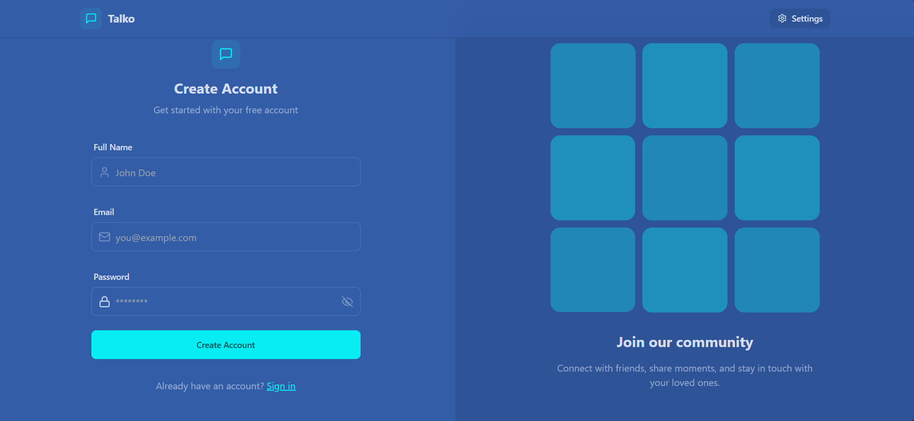
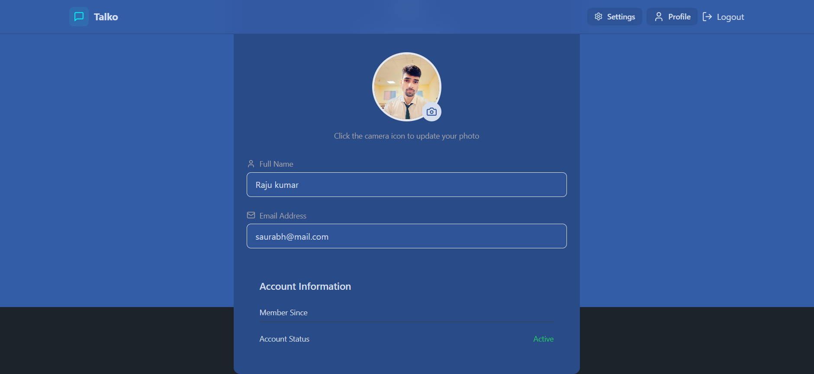
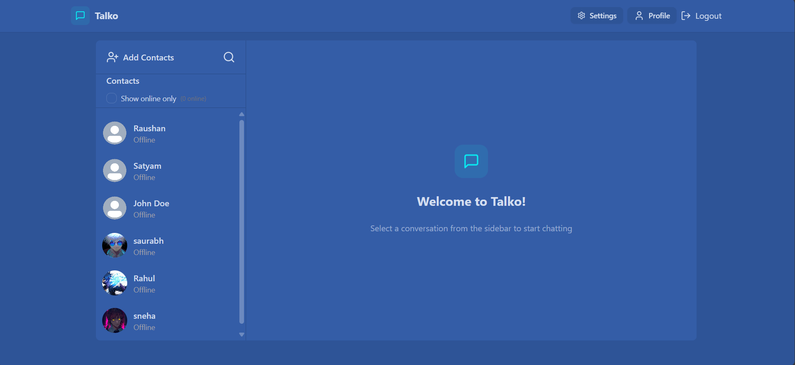
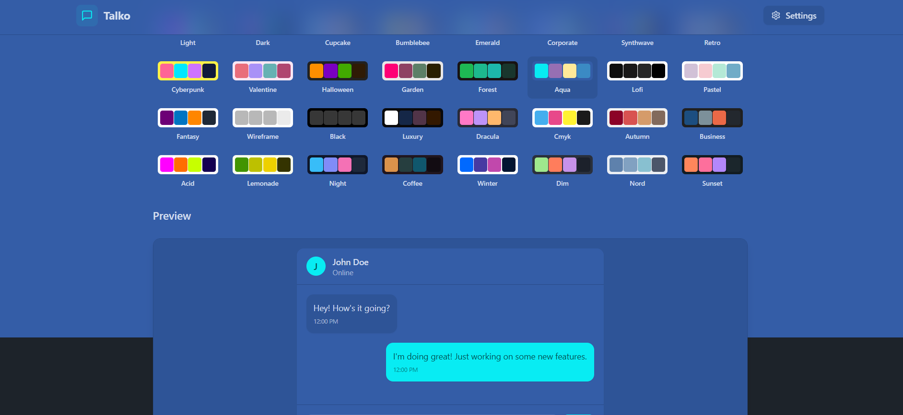

# 💬 Realtime Chat Application

A full-stack realtime chat application with user authentication, profile image upload, and instant messaging. Built with **React**, **Tailwind CSS**, **Zustand**, and **DaisyUI** on the frontend, and **Express.js**, **MongoDB**, **Socket.IO**, and **JWT** on the backend. Media files are handled via **Cloudinary**.

---

## ✨ Features

- 🔐 User Authentication (JWT-based)
- 💬 Realtime one-to-one chat (Socket.IO)
- 🧑‍💼 Profile creation with avatar upload (Cloudinary)
- 📨 Message read/receive sync
- 💻 Clean, responsive UI with DaisyUI + Tailwind CSS
- ⚙️ REST API built with Express & MongoDB
- 🗂️ Global state managed by Zustand

---

## 🛠️ Tech Stack

### Frontend:
- [React](https://reactjs.org/)
- [Tailwind CSS](https://tailwindcss.com/)
- [Zustand](https://zustand-demo.pmnd.rs/)
- [DaisyUI](https://daisyui.com/)
- [Axios](https://axios-http.com/)

### Backend:
- [Express.js](https://expressjs.com/)
- [MongoDB](https://www.mongodb.com/)
- [Socket.IO](https://socket.io/)
- [Cloudinary](https://cloudinary.com/)
- [JWT](https://jwt.io/)

---

## 📷 Screenshots

### Login Page

 

### Signup Page

### Profile Page

### Home Page

### settings Page

---

## 📁 Folder Structure

frontend/ # React frontend
├── components/
├── pages/
├── store/ # Zustand state management
└── ...

backend/ # Express backend
├── controllers/
├── models/
├── routes/
└── ...